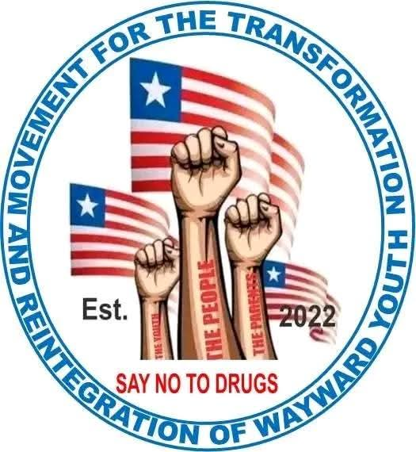
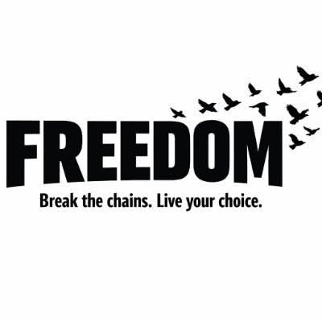

## The problem

We call drug use, including cocaine, a national urgency that is reaching young people across the country.

## What we aim to do

Rehabilitation centers across the country, and contributions of money, time and effort from communities to help government respond. [PLACEHOLDER: how communities can raise drug concerns safely; needs anonymity, moderation and legal review before publishing]

## What has happened

On 7 August 2025 the movement marched to the Capitol with six affiliate organisations under the banner “Liberia Says No To Drugs”: read the [story](/stories/2025-08-march-to-the-capitol/). On 18 November 2025 the movement and affiliated organisations took the anti-drugs awareness campaign into Old Voker Mission School in Paynesville City, Montserrado County, and spoke with students about the danger of drugs. Read the [story](/stories/2025-11-school-visit/) and the [record](/record/). [PLACEHOLDER: other activities, with dates and sources]

## Partners in this work

We work on drugs and recovery alongside two partners.

### MOTARWY

MOTARWY (Movement for the Transformation and Reintegration of Wayward Youth), established in 2022 and headed by Ambassador Anthony Nimely, rehabilitates and reintegrates young people who have been trapped in cycles of addiction and crime. Within the partnership it leads reintegration and youth transformation. It was one of the organisations that marched with us on 7 August 2025.

### Freedom Liberia

Freedom Liberia is a grassroots movement born in Monrovia, working under the umbrella of We The People. Its slogan is "Break the Chains, Live Your Choice", and its mission is to fight drugs, restore dignity and build stronger, cleaner, safer communities. Its four pillars are awareness, rehabilitation, education and empowerment. It is self-sponsored and powered by ordinary Liberians. Within the partnership it drives community cleanups, safe zones and grassroots rehabilitation. Its work includes:

- Weekly community cleanups: trimming grass, painting sidewalks, sweeping trash and restoring public spaces.
- Trash management and recycling, turning waste into opportunity.
- Youth rehabilitation and training.
- Family restoration programmes, reuniting loved ones and rebuilding dignity.
- Daily free study classes for elementary and high-school students in the ghettos, creating safe zones that protect children from drugs and violence.

To reach Freedom Liberia, call or WhatsApp [0888320142](tel:0888320142) write to [liberiawatch@proton.me](mailto:liberiawatch@proton.me), or follow its [official Facebook page](https://www.facebook.com/share/19XLntt277/).

Together, We The People provides the national vision and organisational framework, MOTARWY leads reintegration and youth transformation, and Freedom Liberia drives community cleanups, safe zones and grassroots rehabilitation, so that this work is part of a larger movement for national renewal.

## How to help

[PLACEHOLDER: the specific ways to help with this priority]
